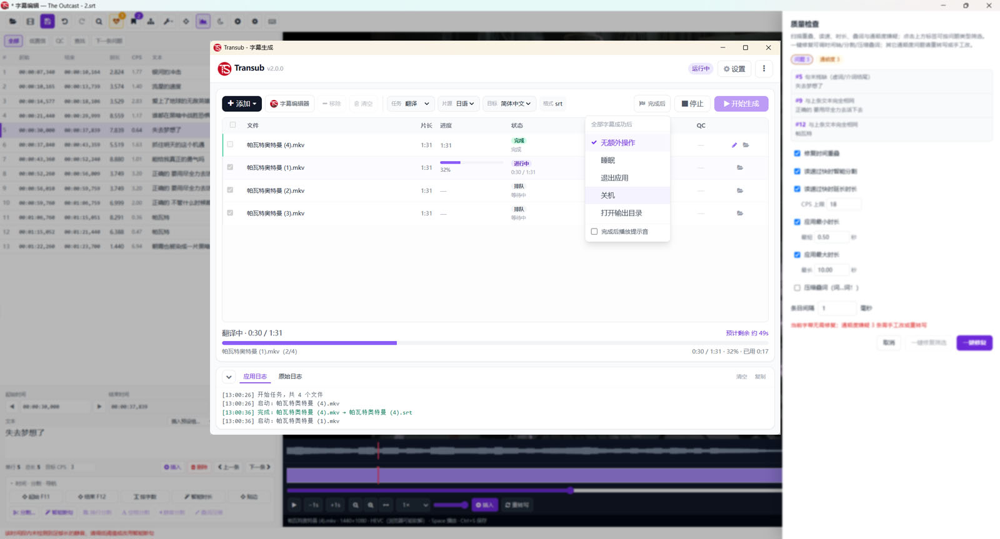
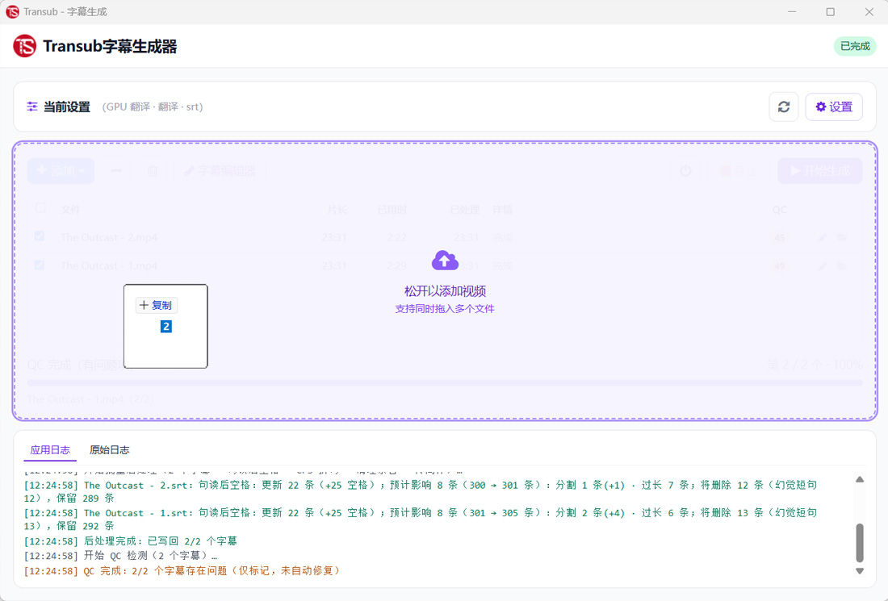
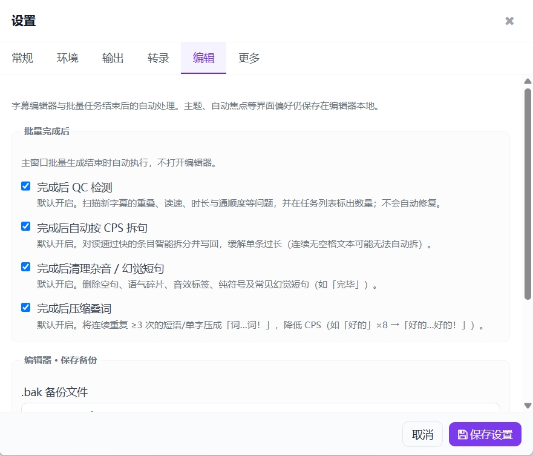
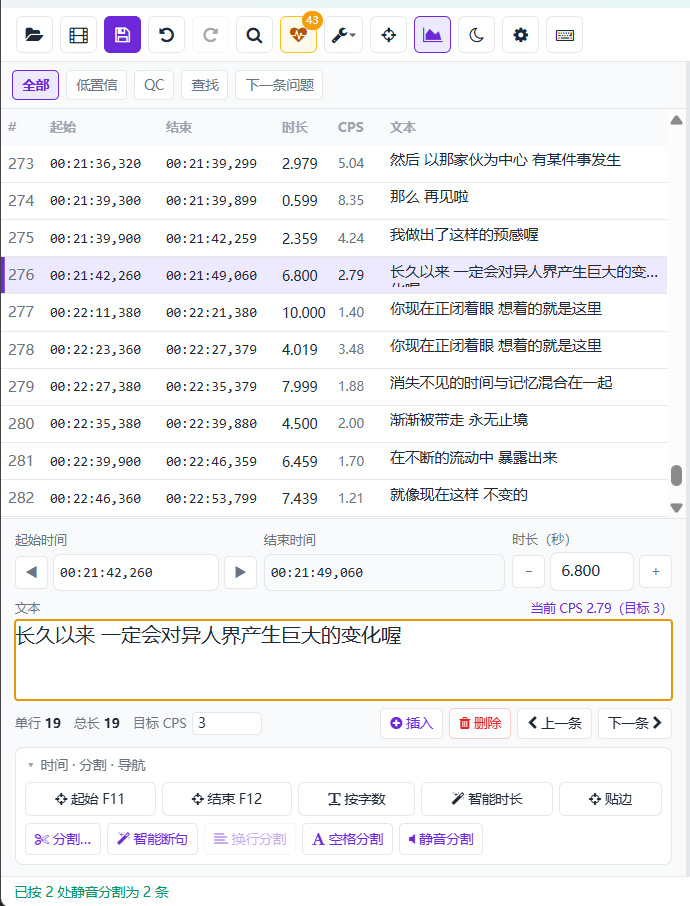
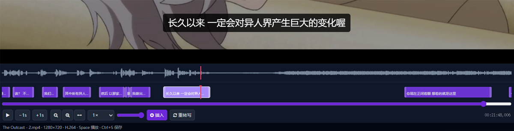

# Transub 字幕生成 & Transub Editor 字幕编辑


**把视频丢进去，字幕就出来了。**  
在编辑器里改时间轴、修读速、统一专名、跑工作流——从生成到成片，一条龙。

Windows 桌面字幕工具 · 当前版本 **2.0.0**  
转录 / 翻译引擎由 [TransWithAI](https://github.com/TransWithAI/Faster-Whisper-TransWithAI-ChickenRice) 提供

[](https://github.com/dlsandy/Transub/releases)
[](LICENSE)




---
**新版本预告**
- 从2.1.0版本开始，引擎部分改用自研**Transub Engine**（将不再支持TranWithAI引擎），获得更精准的对话转录和对话分割，大幅度降低幻听、杂音等情况。
- 新增**更多语言**视频、音频的翻译
- 新增**设置向导**，让环境配置和设置变得更简单
- 新增**LLM推理模型**支持（支持三种方式：Allama等自建LLM服务、第三方LLM服务 和 Transub内置本地LLM）
- 新增**高级翻译**（高级功能）
- 新增**语境重构**（高级功能）
- 新增**影片理解重构**（高级功能）

---
## 2.0 新特性

架构与界面大幅重构，常用操作收进主窗口；冷启动更快，任务状态文案更清晰。并补齐一批实用能力：

- **双语任务**：单次任务即可输出原文与译文，可选合并双语字幕（需分别下载并设置转写 / 翻译模型）
- **双语字幕编辑**：可调整原文 / 译文上下位置，支持双语合并
- **字幕预设**：编辑器按时段批量插入片名、演员、字幕作者等固定文案
- **工作流**：自定义重复流程并一键批处理（已内置两套常用工作流）
- **独立编辑器启动**：通过 Transub Editor 图标 / 快捷方式快速打开，查看与编辑历史字幕
- **任务历史**：支持历史任务的查看、编辑与清除
- **导出繁体中文**：主界面目标语言选繁体中文即可生成繁体字幕
- **设置更友好**：标准 / 专家双模式；配置预设可一键切换常用组合

---

## 适合谁用？

- 需要给**整批视频**快速出 SRT / VTT / LRC 字幕
- 想把 AI 初稿**精修成片**：对口型、控读速、清杂音
- 习惯「拖进去 → 开跑 → 睡一觉 / 关机」的无人值守流程

---

## 亮点功能

### 1. 拖进视频，批量开跑

添加文件或文件夹，选好转写、翻译或双语预设，点「开始生成」。进度、ETA、原始日志一目了然；全部完成后可选睡眠、退出或关机。



- GPU（CUDA）加速，日志里能看到 Smart VAD 分块进度
- 内置参数预设，也可保存自己的常用配置
- 完成后可一键打开字幕编辑器，视频已关联好

---

### 2. 自动优化 TransWithAI 生成的字幕

生成字幕文件后，Transub 自动优化字幕内容，让字幕工作更加轻松。



- 字幕任务完成后，自动对字幕进行 QC 质量检测，字幕质量一目了然
- CPS 自动拆句
- 自动清理杂音、幻听语句
- 对于叠词自动进行压缩

---

### 3. 结构化字幕编辑器

列表、详情、视频预览联动。低置信 / QC / 查找筛选，方便只盯问题行；支持多选批量删除、合并、简繁转换。



- CPS（每秒字符数）列：一眼看出读速过快的条目
- 深色 / 浅色主题，列表宽度可调
- 撤销 / 重做 / 复原；查找替换；自动备份与草稿恢复
- 字幕预设组：按时间范围批量插入固定文案
- 工作流：把常用编辑步骤串成批处理，一键执行

---

### 4. 质量检查 + 一键修复

扫描重叠、读速、时长、通顺度等，按类型筛选；时间类问题可预览影响条数后一键修复。


- 可调 CPS 上限、最小 / 最大时长、条目间隔
- 通顺度嫌疑单独标出，避免误修文案
- 批量任务结束后也可只做 QC 扫描，在任务列表标出问题数

---

### 5. 智能分割与时长工具

读速过快时给出提示；支持智能断句、换行 / 空格切分、静音分割、智能时长等，按场景选用。


- F11 / F12 对齐播放头起止
- 静音分割结合断句词，切点更接近自然句界
- 长任务（静音批处理、贴边、重转写）可随时取消

---

### 6. 视频预览 + 波形时间轴

边播边改：字幕叠在画面上；可选波形层，拖动字幕块微调起止。局部不满意时，可对当前段「重转写」。



- 时间轴缩放平移（Ctrl+滚轮），倍率会记住
- 插入字幕、±1s 跳转、倍速播放
- 常用快捷键：空格播放、`Ctrl+S` 保存

---

### 还有这些省心能力

| 能力 | 说明 |
|------|------|
| 双语任务 | 单次输出原文 + 译文；可选合并双语字幕（需分别设置转写 / 翻译模型） |
| 双语编辑 | 调整原文 / 译文上下位置，支持合并 |
| 字幕预设 | 片名 / 演员 / 作者等按时段批量插入 |
| 工作流 | 自定义批处理流程；内置两套常用工作流 |
| 任务历史 | 查看、编辑与清除历史任务 |
| 术语表 | 全局 + 项目级合并；扫描不一致并一键统一专名 |
| 简繁转换 | 短语优先；可保护术语表词条 |
| 抑幻听 | 转录参数可调；内置「翻译 · 抑幻听」预设 |
| 中文简繁输出 | 翻译 / 双语任务可自动转为简体或繁体 |
| 右键菜单 | 视频「生成字幕」、字幕文件「用编辑器打开」 |
| 仅编辑器 | Transub Editor 独立启动，不打开主任务窗 |
| 检查更新 | 独立更新窗口比对 GitHub Releases |


---


## 下载安装

1. 打开 [Releases](https://github.com/dlsandy/Transub/releases)
2. 推荐下载 `Transub-2.0.0-win.zip`，解压后运行 `Transub.exe`
  （或使用 `Transub-Setup-2.0.0.exe` 安装版）  
  解压目录内有 **Transub Editor** 快捷方式；安装版还会在桌面与开始菜单创建同名快捷方式
3. 另装 [TransWithAI 发行版](https://github.com/TransWithAI/Faster-Whisper-TransWithAI-ChickenRice/releases)，首次启动按引导选择其安装路径

> 当前发行包**未做代码签名**。请优先用 zip；未签名的 Setup 安装包易被 SmartScreen 拦截。后续版本不再提供 portable 便携版。


### 环境要求


| 依赖              | 说明                          |
| --------------- | --------------------------- |
| Windows 10 / 11 | 唯一支持平台                      |
| TransWithAI     | 提供转录、翻译与 Whisper 推理         |
| FFmpeg          | 发行版通常已内置；静音分割 / 贴边 / 波形等依赖它 |


可选：打包后注册资源管理器右键菜单：

```powershell
powershell -ExecutionPolicy Bypass -File tools/register-context-menu.ps1
```

---


## 从源码运行

面向开发者。日常使用请直接下载发行版。需要 **Node.js ≥ 22.12**。

```bash
git clone https://github.com/dlsandy/Transub.git
cd Transub
npm install
npm run setup:ffmpeg   # 若尚无内置 ffmpeg/ffprobe
npm start
```

仅开编辑器：

```bash
npm run start:editor
npm start -- --edit-sub="path\to\file.srt" --edit-video="path\to\video.mp4"
```

也可双击仓库根目录的 `Transub Editor.bat`。

更多脚本、打包与配置字段见下方「开发说明」。变更记录：[CHANGELOG.md](CHANGELOG.md)。

---


## 致谢

**TransWithAI** — 字幕转录、翻译与底层 Whisper 推理完全依赖  
[Faster-Whisper-TransWithAI-ChickenRice](https://github.com/TransWithAI/Faster-Whisper-TransWithAI-ChickenRice)。  
感谢作者与社区的开源工作；使用前请遵循其许可条款。

本项目（Transub）采用 [MIT License](LICENSE)。UI 图标使用 [Font Awesome 4.7](https://fontawesome.com/)（SIL OFL 1.1）。

---

**开发说明**（打包、测试、配置字段）

### 打包

`build:renderer` **必须**在 `dist` / `pack` 之前执行（会把 HTML / JS / 图标拷到 `renderer-dist/`）。打包脚本会自动跑 `verify:packaging`，检查 HTML 引用资源与主进程 `src/js/*-core` 是否都在清单里，避免再次漏打文件。

```bash
npm run dist
npm run build              # zip + Setup (NSIS) + dir
npm run build:zip
npm run build:setup
npm run verify:packaging   # 单独校验 renderer-dist + package.json files
```

产物在 `dist/`。默认发版上传 `Transub-*-win.zip` 与 `Transub-Setup-*.exe`。

### 常用脚本

```bash
npm run build:css
npm run build:renderer
npm run verify:packaging
npm test
npm run lint
npm run setup:ffmpeg
npm run icons
npm run start:editor
```


### 项目结构

```
Transub/
├── _internal/       # 内置 FFmpeg / ffprobe
├── electron/        # 主进程（窗口、桥接、打包入口）
├── src/             # 渲染层源码（开发态直接加载）
├── renderer-dist/   # 打包用渲染产物（build:renderer 生成）
├── tests/           # Vitest
├── tools/           # 构建、图标、打包校验
└── docs/screenshots/
```


### 配置要点

运行时配置为 `transub-settings.json`（开发模式在项目根；打包后在稳定用户目录）。常用字段：

- `installPath` — TransWithAI 目录（含 `infer.exe`）
- `device` — `cuda` / `cpu` / `cuda_low_vram` 等
- `task` — `transcribe` / `translate` / `dual`
- `subFormats` — 如 `srt`、`vtt`、`lrc`
- `ffmpegPath` — 可选；留空优先用内置

其它数据文件：`transub-glossary.json`、`transub-text-presets.json`、`transub-presets.json`、`transub-editor-history.json`、`transub-editor-workflows.json`。

可参考 [`transub-settings.example.json`](transub-settings.example.json)（含本机路径，勿提交）。

### 应用更新

设置中「检查更新」查询 [GitHub Releases](https://github.com/dlsandy/Transub/releases)：zip 解压版打开下载页；若使用带 `latest.yml` 的 NSIS 安装版，可应用内更新。

