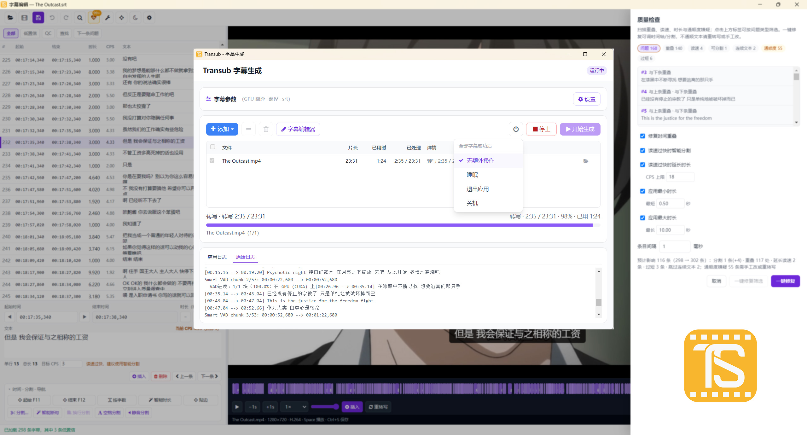

# Transub

Transub 是基于 [TransWithAI](https://github.com/TransWithAI/Faster-Whisper-TransWithAI-ChickenRice) 的 Windows 桌面字幕工具（当前版本 **1.3.2**）。**字幕转录、翻译及 Whisper 推理由 TransWithAI 提供**；Transub 在此基础上提供批量任务管理、参数预设、任务历史，以及带视频同步的结构化字幕编辑器（SRT / VTT / LRC）。

> **特别感谢 [TransWithAI / Faster-Whisper-TransWithAI-ChickenRice](https://github.com/TransWithAI/Faster-Whisper-TransWithAI-ChickenRice)**
>
> 本项目的核心字幕转录、翻译与 Whisper 推理能力，均来自 TransWithAI 项目。Transub 不包含推理引擎与模型，仅在其之上提供图形界面与编辑工具。
>
> - 项目主页：[github.com/TransWithAI/Faster-Whisper-TransWithAI-ChickenRice](https://github.com/TransWithAI/Faster-Whisper-TransWithAI-ChickenRice)
> - 下载发行版：[Releases](https://github.com/TransWithAI/Faster-Whisper-TransWithAI-ChickenRice/releases)
>
> 感谢 TransWithAI 作者与社区的开源贡献。使用前请遵循 TransWithAI 项目的许可条款。



## 功能概览

### 批量字幕生成
- 视频/音频队列批量处理，转写或翻译为 SRT、VTT、LRC；支持拖放与文件夹扫描
- GPU 环境自动检测，内置与自定义参数预设；配置可导入 / 导出
- 任务历史记录；全部成功后可选择睡眠、退出应用或定时关机
- 托盘进度与预计剩余时间（ETA）；可选开始时最小化到托盘
- 可选「完成后 QC 检测」：仅扫描并在任务列表标出问题数（不自动修、不自动开编辑器）
- 可选右键菜单：「用 Transub 生成字幕」；字幕文件（SRT / VTT / LRC）右键「用 Transub 字幕编辑器打开」，无需启动主程序
- 完成后可从任务列表一键打开字幕编辑器并关联视频

### 字幕编辑器（v1.3.0 重点升级）

面向成片精修的结构化编辑工作台：列表、详情、视频预览与时间轴联动，支持从任务完成一键进入，也可右键单独打开编辑器。

**质量与通顺度**
- **质量检查（QC）**：扫描重叠、过快读速（CPS）、过短/过长时长、通顺度嫌疑；支持一键修复与问题筛选
- **通顺度规则**：标注口吃重复、语气碎片、句末残缺、音效/杂音标签等，避免误修文案
- **低置信提示**：本地启发式估可疑条目，列表可筛「低置信 / QC / 查找命中」，并跳到下一条问题
- **删除杂音**：批量清理语气词碎片与音效标签类条目

**术语与专名**
- **术语表**：全局与项目级（字幕旁 sidecar）合并维护；扫描全文不一致并一键统一专名
- **简繁转换**：短语优先 + 字符映射；可保护术语表词条

**时间轴与音频对齐**
- **可视化时间轴**：点击定位、拖拽字幕块调时；可选波形层（默认关）
- **音频贴边**：按静音将起止贴到语音边界；智能时长按静音缩短过长条目
- **分割（8 种）**：智能断句、换行、空格、字符数、均分、光标、播放头、静音切分
- **批量**：智能分割 / 静音分割 / 时长调整 / 智能调整（重叠与 CPS）；长任务可取消

**重转写与交互**
- **按时长重转**：从起始点按指定秒数调用 TransWithAI 重转当前段（需关联视频）
- **多选批量**：Ctrl/Shift 多选后删除、合并、简繁、偏移等
- **自动备份**：保存写 `.bak`；定时草稿与打开时恢复
- **深色 / 浅色主题**、可调列表宽度、播放跟随焦点
- **撤销 / 重做 / 复原到打开时**；查找替换；全体或选中时间轴 ±0.5s
- 快捷键：`Ctrl+S` 保存、`Ctrl+Z` / `Ctrl+Y` 撤销重做、`Ctrl+F` / `Ctrl+H` 查找替换、`Ctrl+A` 全选、`F11` / `F12` 对齐播放头、空格播放暂停、`Enter` 插入字幕

## 环境要求

| 依赖 | 说明 |
|------|------|
| **Windows 10/11** | **唯一支持平台**（不提供 macOS / Linux 发行版） |
| **Node.js 22.12+** | 开发与从源码运行（Electron 43 要求） |
| **TransWithAI** | 需单独安装 [TransWithAI 发行版](https://github.com/TransWithAI/Faster-Whisper-TransWithAI-ChickenRice/releases) |
| **FFmpeg**（推荐） | 运行 `npm run setup:ffmpeg` 下载到 `_internal/bin/`（或自行放入）；静音分割 / 智能时长 / 音频贴边依赖 FFmpeg；也可在设置中指定自定义路径 |

## 快速开始

### 从源码运行

```bash
git clone https://github.com/dlsandy/Transub.git
cd Transub
npm install
npm run setup:ffmpeg   # 若 _internal/bin 尚无 ffmpeg/ffprobe，则自动下载
npm start
```

仅启动字幕编辑器（不打开主窗口）：

```bash
npm run start:editor
# 或直接打开指定字幕（可附带视频）
npm start -- --edit-sub="path\to\file.srt"
npm start -- --edit-sub="path\to\file.srt" --edit-video="path\to\video.mp4"
```

首次启动会在应用内引导配置 TransWithAI 安装路径。也可参考 [`transub-settings.example.json`](transub-settings.example.json) 手动创建 `transub-settings.json`（该文件含本机路径，**不要提交到 Git**）。

### 打包发布

```bash
npm run dist
# 或使用 Windows 打包脚本（可选：只打安装包 / 便携版）
npm run build
npm run build:setup
npm run build:portable
```

安装包与便携版输出到 `dist/`（或经 `.packaging` 中转）。发版时请一并上传 `latest.yml`（及 `.blockmap`），以便 NSIS 安装版使用应用内更新。

### 应用更新（GitHub）

设置中的「检查更新」会查询 [GitHub Releases](https://github.com/dlsandy/Transub/releases)：

| 安装方式 | 行为 |
|---------|------|
| **NSIS 安装版** + Release 含 `latest.yml` | 可应用内下载并重启安装 |
| **便携版** / 无 `latest.yml` / 开发模式 | 比对版本后打开下载页，需手动安装 |

当前**不进行代码签名**（付费 Authenticode）。首次运行可能被 SmartScreen 拦截，选择「仍要运行」即可。

变更记录见 [`CHANGELOG.md`](CHANGELOG.md)。

### 注册右键菜单

打包完成后：

```powershell
powershell -ExecutionPolicy Bypass -File tools/register-context-menu.ps1
```

会为视频文件注册「用 Transub 生成字幕」，为 SRT / VTT / LRC 注册「用 Transub 字幕编辑器打开」（仅启动编辑器，不打开主窗口）。

移除菜单：

```powershell
powershell -ExecutionPolicy Bypass -File tools/register-context-menu.ps1 -Unregister
```

## 开发

```bash
npm run build:css      # 编译 Tailwind CSS
npm run build:renderer # 打包前端资源（发布前）
npm test               # Vitest 单元测试
npm run test:coverage  # 测试覆盖率
npm run lint           # ESLint
npm run setup:ffmpeg   # 下载内置 FFmpeg / ffprobe 到 _internal/bin
npm run icons          # 重新生成应用图标
```

## 项目结构

```
Transub/
├── _internal/              # 内置 FFmpeg / ffprobe（npm run setup:ffmpeg）
├── electron/               # Electron 主进程（IPC、TransWithAI 桥接、字幕格式）
├── src/                    # 渲染进程 UI
│   └── js/subtitle-editor/ # 字幕编辑器模块（utils / undo / prefs / …）
├── tests/                  # Vitest 单元测试
├── tools/                  # 构建与安装脚本
└── package.json
```

## 配置说明

运行时配置保存在项目根目录的 `transub-settings.json`（开发模式）或应用目录下。主要字段：

- `installPath` — TransWithAI 安装目录（含 `infer.exe`）
- `device` — 推理设备：`cuda` / `cpu` / `cuda_low_vram` 等
- `task` — `transcribe`（转写）或 `translate`（翻译）
- `subFormats` — 输出格式，如 `srt`、`vtt`、`lrc`
- `ffmpegPath` — FFmpeg 可执行文件路径（可选；留空则优先使用内置 `_internal/bin`）

## 致谢与许可

### 致谢

**TransWithAI** — 本项目的字幕转录、翻译及底层 Whisper 推理，完全依赖 [Faster-Whisper-TransWithAI-ChickenRice](https://github.com/TransWithAI/Faster-Whisper-TransWithAI-ChickenRice) 提供。感谢 TransWithAI 作者与社区的开源工作。

| 项目 | 链接 |
|------|------|
| TransWithAI 仓库 | https://github.com/TransWithAI/Faster-Whisper-TransWithAI-ChickenRice |
| TransWithAI 发行版 | https://github.com/TransWithAI/Faster-Whisper-TransWithAI-ChickenRice/releases |

### 许可

本项目（Transub）采用 [MIT License](LICENSE)。

TransWithAI 为独立项目，使用前请遵循其各自许可条款。UI 使用 [Font Awesome 4.7](https://fontawesome.com/)（SIL OFL 1.1）。
