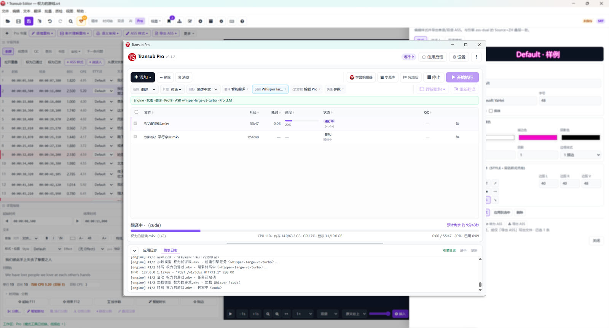
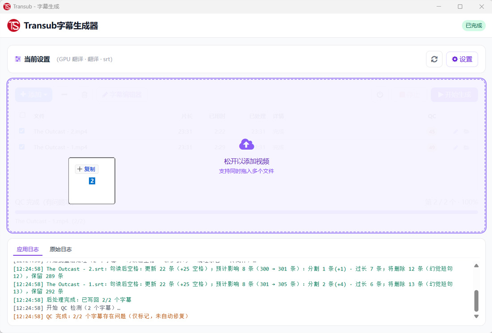
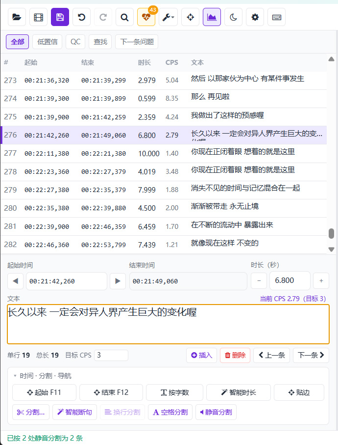
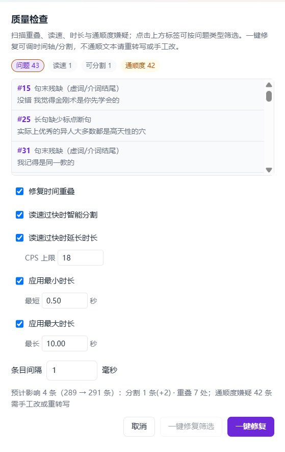
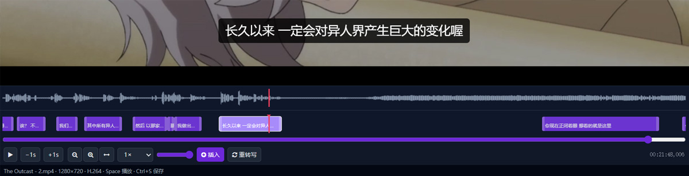
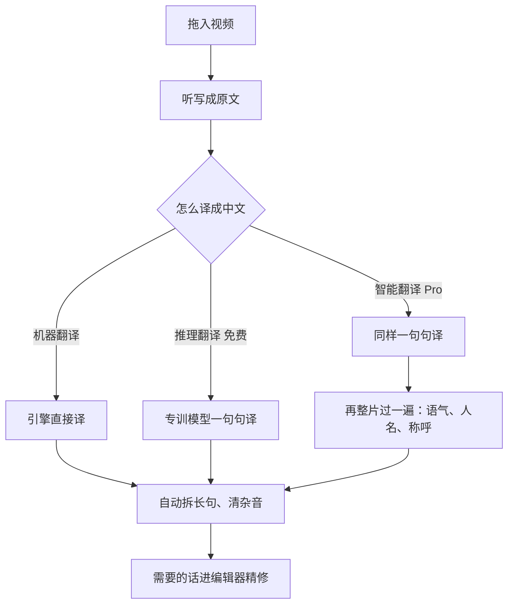

# Transub

**把视频拖进去，出能上片的字幕。**  
Windows 桌面 · 本地运行 · 转写 / 翻译 / 双语 · SRT · VTT · ASS

[下载](https://github.com/dlsandy/Transub/releases) · [变更记录](CHANGELOG.md) · [爱发电 / Pro](https://afdian.com/a/transub) · [问题反馈](https://github.com/dlsandy/Transub/issues)

<p align="center">
  
</p>

---

## 目录

- [适合谁](#适合谁)
- [怎么用](#怎么用)
- [选哪种翻译](#选哪种翻译)
- [下载安装](#下载安装)
- [Pro 要不要买](#pro-要不要买)
- [从源码运行](#从源码运行)
- [许可](#许可)

---

## 适合谁

- 一整批视频要出字幕，不想一条条丢进网页
- 机翻初稿还不能用：句子太长、对白重叠、读起来太快、语气词一堆
- 日译中为主，也要处理多语种、混在一起的文件
- 开跑后可以离开：任务结束可选睡眠 / 退出 / 关机

免费就能走完：**听写 → 翻译 → 质检 → 编辑器精修**。Pro 是在这之上把语气、人名和质检再推深一档，不是「不买就不能用」。

---

## 怎么用

1. [下载 zip](https://github.com/dlsandy/Transub/releases)，解压后打开 `Transub.exe`
2. **第一次请走设置向导**（按电脑勾选并下载模型，体积较大，请留足时间和磁盘）
3. 把文件或文件夹拖进主窗口，选 **转写 / 翻译 / 双语**，点开始
4. 跑完后列表会标出问题数；需要改的，点进 **字幕编辑器** 对着画面改

主窗口负责整批出稿；编辑器负责一条条改到能上片（预览、波形、读速、一键修时间问题）。编辑器也可以单独打开。

界面可切简体 / 繁体。任务进行中能增删队列；中途停了可以断点继续。









---

## 选哪种翻译

任务选「翻译」或「双语」时，三种方式都从**同一份听写稿**出发，差别在中文怎么来。

| | 机器翻译 | 推理翻译 | 智能翻译 |
| --- | --- | --- | --- |
| **费用** | 免费 | 免费 | 需 Pro |
| **你得到什么** | 快，能看懂 | 日语对白更准、更像台词 | 在推理翻译之上，再把全片语气、人名调顺 |
| **适合** | 赶工、多语种、先出一版 | **大多数日译中**（推荐先试这个） | 已经能用、还想更像人在说话 |

日译中优先用 **GalTransl 7B** 或 **Sakura 7B**（向导里会按硬件建议）。

**实际会经历的步骤：**


```mermaid
flowchart TB
  A[拖入视频] --> B[听写成原文]
  B --> C{怎么译成中文}
  C -->|机器翻译| D[引擎直接译]
  C -->|推理翻译 免费| E[专训模型一句句译]
  C -->|智能翻译 Pro| F[同样一句句译]
  F --> G[再整片过一遍：语气、人名、称呼]
  D --> H[自动拆长句、清杂音]
  E --> H
  G --> H
  H --> I[需要的话进编辑器精修]
```

一句话：**推理翻译负责把句子译准；Pro 负责让整集听起来是同一个人在说。**  
Pro 多出来的那一遍可以关（设置 → Pro → 智能翻译）。关掉之后，效果接近推理翻译。

非日语、或你关掉「用专训模型译句」时，智能翻译会改由通用对话模型按行来译，质量取决于你选的模型。

---

## 下载安装

| | |
| --- | --- |
| 系统 | **仅 Windows 10 / 11** |
| 安装 | 解压即用，没有安装程序 |
| 依赖 | 识别、翻译、FFmpeg 都已带上，不必另装 Python |

1. 打开 [Releases](https://github.com/dlsandy/Transub/releases)，下载 **zip**
2. 解压后运行 `Transub.exe`（同目录有编辑器快捷方式）
3. 走完设置向导，再开始第一批任务
4. 以后用软件里的「检查更新」即可；已经下载的模型会保留

> [!NOTE]
> 安装包目前没有代码签名。Windows 可能提示「未知发布者」，选仍要运行即可。可选把「用 Transub 生成字幕」加到右键菜单：`tools/register-context-menu.ps1`

卡住或报错：软件右上角 **使用反馈**，或开 [Issue](https://github.com/dlsandy/Transub/issues)。

---

## Pro 要不要买

多数人用免费的听写 + 推理翻译 + 编辑器就够。Pro 适合：已经在用，还想少改几遍稿。

| 买了之后 | 具体是什么 |
| --- | --- |
| 智能翻译 | 先按句译准，再整片把语气、人名调顺（可关；模型可本机或填自己的 API Key） |
| 影视音频增强 | 先把人声分出来再听写，嘈杂片更稳 |
| 语境 / 影片理解重构 | 按场次用大模型改写，适合整段不像人话时 |
| 双语语义审阅 | 查出漏译、错译，建议可一键采纳 |
| QC 智能修复 | 质检问题不只标红，还能断句、重转写、润色 |
| ASS 样式 | 转 ASS、说话人样式、特效、预览里拖位置 |

购买：[爱发电](https://afdian.com/a/transub) → 软件里 **设置 → Pro** → 填订单号。  
买断覆盖当前大版本（例如 3.x）；出 4.0 需另购（有升级优惠）。开通后不退款。

本机跑大模型比较吃配置，大约 **内存 16 GB + 独立显卡 8 GB 显存** 更从容；也可以只用云端 API，不占本机显卡。详见 [Pro 说明](docs/advanced-boundary.md)。

---

## 从源码运行

给要改程序的人。日常使用请直接 [下载发行包](https://github.com/dlsandy/Transub/releases)。

需要 **Node.js ≥ 22.12**。

```bash
git clone https://github.com/dlsandy/Transub.git
cd Transub
npm install
npm run setup:ffmpeg
# 将 Engine 独立版放到 transub-engine/（含 runtime\python.exe）
npm start
```

只开编辑器：`npm run start:editor`。打包：`npm run dist` 或 `build-win.bat`。

开发文档：[架构](docs/architecture.md) · [引擎边界](docs/engine-boundary.md) · [ASR](docs/asr.md) · [变更记录](CHANGELOG.md)

---

## 许可

- 开源部分：[MIT](LICENSE)
- Pro 模块：[LICENSE-PRO](LICENSE-PRO) · [NOTICE](NOTICE)
- UI 图标：[Font Awesome 4.7](https://fontawesome.com/)（SIL OFL 1.1）
