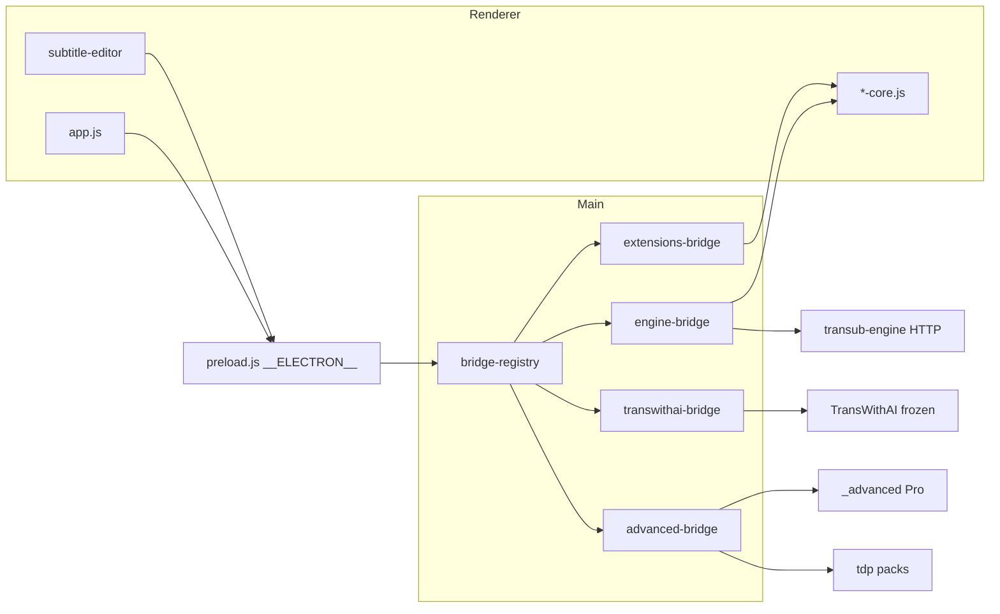

# Transub 架构（桌面壳）

产品边界见 [engine-boundary.md](./engine-boundary.md)、[advanced-boundary.md](./advanced-boundary.md)。本文描述 Electron 仓库内的分层与改动纪律。

## 进程与 IPC

- 入口：`electron/main.js`；渲染层经 `preload.js` 的 `__ELECTRON__`，禁止裸 `ipcRenderer`。
- 重桥懒加载：`electron/bridge-registry.js`。
- 全局算力单槽：`electron/compute-task-lock.js`（批处理 / 重转写 / Pro LLM / Sakura 互斥）。

## 目录职责

| 路径 | 职责 |
|------|------|
| `electron/` | 主进程、IPC、FFmpeg、更新、窗口 |
| `src/js/*-core.js` | 可测纯逻辑（Node + 浏览器 UMD） |
| `src/js/app.js` | 主窗口批处理壳（接线 only） |
| `src/js/subtitle-editor.js` + `src/js/subtitle-editor/` | 编辑器壳 + parts |
| `transub-engine/` | Python ASR / Opus / `/v1` |
| `_advanced/` | Pro 闭源模块（发行旁路） |
| `shared/tdp/`、`tdp/` | 语言包装载与运行时 |
| `tools/` | 打包、TDP 编码、训练、冲突报告 |
| `tests/` | Vitest；优先测 cores / electron helpers |

## 主链路

1. 批量：`app.js` → `engine-bridge` → Engine `/v1`（或冻结的 TWAI）。
2. 译中：Opus | Sakura（`engine-mt-adapter`）| Pro 智能翻译（默认：专训句级 + 剧情贴合润色）。
3. 后处理：`mt-sanitize-core` + opaque ZH + TDP D01 + QC / 观影精简（分层与意图模型见 [mt-sanitize.md](./mt-sanitize.md)）。
4. 编辑：JASSUB + FFmpeg 波形 + QC / 工作流。
5. 更新：zip 多镜像（`app-updater`）；发行包当前未做 Authenticode（后续运维项）。

## 模块所有权（改动归口）

| 领域 | 优先改动位置 |
|------|----------------|
| MT sanitize / opaque | `src/js/mt-sanitize-core.js`、`mt-opaque-strings.js`、`mt-sanitize-intent-core.js`；规则后 `encode:tdp`；见 [mt-sanitize.md](./mt-sanitize.md) |
| 主窗口感知队列 | `src/js/sense-queue-core.js`（`app.js` 只接线） |
| 感知失败引导 | `src/js/sense-recovery-core.js` |
| 批处理 / ASR 失败引导 | `src/js/batch-recovery-core.js` |
| ASR 设置归一 / 推荐芯片文案 | `src/js/asr-settings-core.js` |
| ASR 桌面编排说明 | [asr.md](./asr.md) |
| ASR 候选：Cohere Transcribe | [asr-cohere-transcribe-feasibility.md](./asr-cohere-transcribe-feasibility.md) |
| 主窗口任务表排序 | `src/js/task-list-sort-core.js` |
| 主窗口任务行 HTML | `src/js/task-list-row-core.js` |
| 主窗口进度展示 | `src/js/progress-display-core.js` |
| 设置选项归一化 | `src/js/settings-options-normalize-core.js` |
| 完成后操作 / QC 横幅 | `src/js/post-task-qc-ui-core.js` |
| 智能翻译混合句级 | `src/js/smart-translate-hybrid-core.js`、`electron/smart-translate-hybrid.js` |
| 智能翻译剧情贴合润色 | `src/js/smart-translate-polish-core.js`（抽样/启发式，开源）、闭源 `electron/advanced-smart-translate.js` |
| 智能翻译忠实复核 / 称呼一致性 | 闭源 `src/js/smart-translate-verify-core.js`、`smart-translate-address-core.js`（仅 `_advanced` 打包） |
| 主窗口翻译芯片文案 | `src/js/translate-mode-chip-core.js` |
| 主窗口引擎模型 UI | `src/js/engine-models-ui-core.js`（含 pick-catalog 归一化 / 合并） |
| 主窗口手动下载文案 | `src/js/engine-manual-download-core.js` |
| 主窗口缺失模型告警 | `src/js/engine-missing-models-core.js` |
| 主窗口开始阻断 / 就绪条 / 参数芯片 | `src/js/start-readiness-core.js` |
| 主窗口选中态工具栏显隐 | `src/js/selection-toolbar-core.js` |
| 主窗口设置持久化组装 | `src/js/settings-saved-options-core.js` |
| 主窗口批量后处理开关计划 | `src/js/post-batch-autofix-plan-core.js` |
| 主窗口重新翻译计划 | `src/js/retranslate-plan-core.js` |
| 感知结果定稿 / 语种先验 / 采纳 | `src/js/sense-finalize-core.js` |
| 编辑器 QC 摘要 UI | `src/js/subtitle-editor/qc-summary-ui.js` |
| 编辑器分割计划 | `src/js/subtitle-editor/cue-split-plan.js` |
| 编辑器静音切分 | `src/js/subtitle-editor/silence-split-plan.js` |
| 编辑器智能时长 / 贴边 | `src/js/subtitle-editor/audio-snap-duration-plan.js` |
| 编辑器局部重转写计划 | `src/js/subtitle-editor/retranscribe-range-plan.js` |
| 编辑器批量筛选预览 | `src/js/subtitle-editor/batch-cue-filter-plan.js` |
| JA ASR domain | `shared/ja-asr-domain-fixes.json` + TDP D01 |
| TDP 编解码 | `tools/encode-tdp-pack.js`、`electron/tdp-runtime.js`、`src/js/tdp-*-core.js` |
| 应用更新 | `electron/app-updater.js`、`update-manifest-core.js`、`zip-update-*` |
| Pro 门控 / 许可 | `electron/advanced-gates.js`、`advanced-bridge.js`、`advanced-entitlement-core.js` |
| Engine 任务编排 | `electron/engine-bridge.js` + `engine-run-asr-job.js` / `asr-cue-cleanup.js` / `engine-job-progress.js` / `engine-spawn-utils.js` / `engine-batch-item.js` / `engine-download-info.js` / `engine-runtime-env.js` / `engine-runtime-extras.js` / `engine-log-io.js` / `engine-process-lifecycle.js` / `engine-progress-emit.js` / `engine-batch-history.js` / `engine-range-asr-policy.js` / `engine-batch-mt-plan.js` / `engine-batch-postprocess-plan.js` / `asr-diagnostics-export.js` / `asr-domain-fix-trace.js` / `engine-*.js` helpers |

## 反巨石纪律

- **禁止**在 `app.js`、`subtitle-editor.js`、`engine-bridge.js`、`extensions-bridge.js`、`advanced-bridge.js`、`transwithai-bridge.js` 中新增可抽离的纯逻辑或大段业务。
- 新逻辑优先：`src/js/*-core.js`、`src/js/subtitle-editor/*`、`electron/` 下小模块；巨石文件只保留 DOM / IPC / `state` 接线。
- 渲染脚本加载：在对应 HTML 中于壳脚本前插入 `<script>`（UMD `global.Transub…`）；`tools/build-renderer.js` 按文件复制压缩，无需新 entry。
- TransWithAI（`engineBackend=twai`）：**功能冻结**，设置界面已移除切换入口；旧配置仍可读取，目标主版本 4.x 移除。

## 发版前冒烟

- 清单：[`docs/smoke-checklist.md`](./smoke-checklist.md)
- 自动化预检：`npm run smoke:preflight`（renderer 构建、packaging/release 检查、关键 core 测试）

## 相关规则

- `.cursor/rules/no-monolith-growth.mdc`
- `.cursor/rules/mt-sanitize-anti-regression.mdc`
- `.cursor/rules/tdp-after-training.mdc`
