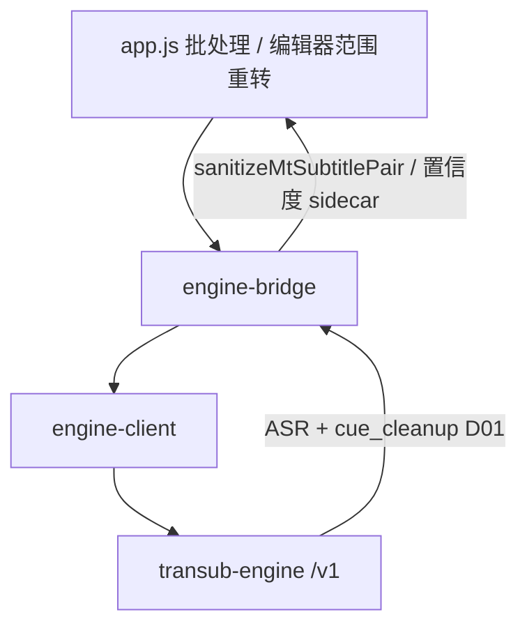

# ASR（桌面软件层）

引擎契约细节见 [`transub-engine/docs/api-v1.md`](../transub-engine/docs/api-v1.md) 与 [engine-boundary.md](./engine-boundary.md)。本文只覆盖 **Transub 桌面侧** 编排、回退、置信度与排障。

**已接入：** [Cohere Transcribe 本地 ASR](./asr-cohere-transcribe-feasibility.md)（`cohere-transcribe-03-2026`；引擎 `cohere-asr`；不绑 CrispASR）。

## 流程

1. 创建任务：`POST /v1/jobs`（`engine-run-asr-job` 可按模型链 failover）。
2. 等待：优先 `GET /v1/jobs/{id}/events`（SSE），失败则 HTTP 轮询（`waitJob`）。
3. 成功后：后处理 → 域修正 → 置信度 sidecar；完成行写入 **实际 ASR 模型**（含回退标注）。
4. 失败 / 取消：若存在 `asr_done` / `mt_done` checkpoint，UI 可「从断点继续」。

## 模型与回退

| 场景 | 候选链 |
|------|--------|
| 主模型 SenseVoice | SenseVoice → whisper-tiny → whisper-large-v3-turbo |
| Cohere Transcribe | Cohere → parakeet-tdt-0.6b-v2 → SenseVoice → tiny（必要时 + turbo） |
| JA / anime / kotoba / Reazon / Qwen ASR | 主模型 → **同族专科** → SenseVoice → tiny（必要时 + turbo） |
| 其他 Whisper 等 | 主模型 → SenseVoice → tiny（必要时 + turbo） |

实现：`electron/engine-range-asr-policy.buildBatchAsrCandidates`（范围重转与整文件 batch 共用）。专科链按主模型族优先试兄弟专科（例如 anime → Qwen Galgame 1.7B → kotoba → whisper-ja），避免空结果时立刻掉到通用 tiny。

内容档（如 `av_soft` → `anime-whisper` / 可选 `qwen3-asr-1.7b-ja-anime-galgame`）仍由 `content-profile-core` / 感知覆盖；回退链在空结果 / 缺模型时生效。

**Qwen3-ASR：** 默认 TEN/VAD 帧时间戳（不加载 ForcedAligner，约省 1GB 显存）；`timingAlignModel=qwen3-forced-aligner-0.6b` 时才用词级对齐。可选 `timingAlignModel=firered` 或 VAD 选 `firered-vad` 改用 FireRedVAD。专科含 `qwen3-asr-0.6b`、`qwen3-asr-1.7b-ja-anime-galgame`、`qwen3-asr-1.7b-ja`（neosophie）。

**FireRedVAD：** 随包装（`firered-vad`，约 2MB 权重 + 内置 `fireredvad` wheel）。用于 anime-whisper / Qwen 的 VAD 拥有时间轴路径；默认仍为 TEN。运行需 torch（与 SenseVoice/Qwen 相同，按需安装）。

## Sense / 语种

- 自动感知：`POST /v1/detect-language`（约 12s 窗；桌面常跳过片头 60–180s）。
- Job `language`：表单或感知结果；`auto` 交给引擎。

## 域修正（D01）

| 落点 | 说明 |
|------|------|
| 引擎 `cue_cleanup` | 热加载 active TDP D01 + `shared/ja-asr-domain-fixes.json` |
| 桌面 `sanitizeMtSubtitlePair` | 文件级兜底；日志带 `[asr-domain]` 摘要 |

规则必须跨作品可复用（见 `mt-sanitize-anti-regression`）。**训练节奏（流程，非产品开关）**：有真实坏例再开 pass → 全量 `tests/mt-sanitize.test.js`（D01/ASR 变则再跑 `tests/tdp-pack.test.js`）→ `npm run encode:tdp`（有私钥则 `--sign`）。不要为单片番号写死规则。

## 置信度

- Whisper：`avgLogprob` / `noSpeechProb` → `.transub.json`
- 其他后端：`confidence` / `score` / `probability`；否则启发式（短句 / 纯标点偏低）
- 入口：`electron/asr-confidence-seed.js` + `subtitle-meta-core`
- **整文件**：`seedAsrConfidenceMeta`（覆盖写入）
- **范围重转写**：`mergeRangeAsrConfidenceMeta` / `mergeRangeAsrConfidenceFromCues`（按时间窗合并进既有 sidecar；编辑器保留 cue 分数字段并刷新低置信徽章）

## 断点恢复

- 引擎：`POST /v1/jobs/{id}/resume`，`GET …/checkpoint`
- 桌面：`transub-engine-resume-job` / 任务行「前进」按钮
- 典型：ASR 已完成、MT/外部适配器失败或取消后继续，避免整段重转写

## 进度：SSE vs 轮询

- **产品默认**：`waitJob({ preferSse: true })` — SSE 推送阶段，结束时再 `GET` 快照取 result。
- SSE 不可用时自动回退轮询（兼容旧引擎 / 代理）。
- 模型下载 / GPU ensure 一直走 SSE。

## 并发

| 层 | 行为 |
|----|------|
| 桌面 `compute-task-lock` | **全局单槽**（批处理 / 范围转写 / Pro LLM / Sakura 互斥） |
| 引擎 `TRANSUB_MAX_CONCURRENT_JOBS` | 默认 1（1–8）；提高后桌面仍串行占锁，除非改锁策略 |

因此产品路径仍是「一次一个重任务」；引擎多 job 主要用于引擎侧调试。

主窗口「开始执行」在空闲却仍被算力锁挡住时，会自动 `force-release` 残留锁（常见于编辑器区间重转写异常退出），并 toast 说明原因；禁用态按钮仍可点击以显示阻塞原因。

## 范围重转写

编辑器局部重转写（`transcribeRangeWithEngine`）在时间轴 remap 后走与 batch 源轨相同的 **ASR 清理**：

1. `ja-person-names-core.stripAsrHallucinationLoopsInCues`
2. `mt-sanitize-core.correctJaAsrDomainMishearsInCues`

实现：`electron/asr-cue-cleanup.js`（可用 `jaAsrDomainFix` / `asrNameLoopClean` 关闭）。

若传入 `subtitlePath`，清理后还会 **按时间窗合并** ASR 置信度到 sidecar（QC 智能修复同理）。

## 设置项（桌面）

| 选项 | 位置 | 作用 |
|------|------|------|
| `perfProfile` | 设置 → 性能 → 转写偏好；专家快捷「偏好」 | 写入 job：`quality`（默认）/ `speed` |
| `engineProfile` | 设置 → 性能 → 性能档位 | 模型推荐/下载档（speed/balanced/quality），与 `perfProfile` 独立 |
| 硬件推荐 ASR | 设置 → 性能芯片；专家快捷「推荐」；感知 finalize | `POST /models/recommend`；不覆盖 JA/AV 专科模型 |

感知采纳时：`sense-finalize` 在 `refineSenseModels` 之后调用 `applyHardwareAsrRecommend`（已安装且当前非 whisper-ja / anime / kotoba / reazon / qwen 专科时才改写）。

## 诊断包

失败行「听诊器」或 IPC `transub-engine-export-diagnostics` → 本地目录 `asr-diag-*`（`manifest.json` + 日志尾），**不上云**。

失败 / 可恢复取消时，任务行状态区还会显示 **恢复芯片**（重试、从断点继续、打开引擎日志、改用 CPU、更换 ASR、导出诊断），由 `batch-recovery-core` 按错误码推断主操作。

## 相关代码

| 模块 | 职责 |
|------|------|
| `electron/engine-run-asr-job.js` | create/wait/failover/resume |
| `electron/engine-client.js` | HTTP + SSE wait |
| `electron/engine-batch-success-handoff.js` | 完成后置信度 sidecar |
| `src/js/batch-recovery-core.js` | 失败可操作引导 + 行内芯片 HTML |
| `electron/asr-diagnostics-export.js` | 诊断包 |
| `electron/asr-domain-fix-trace.js` | 域修正摘要 |
