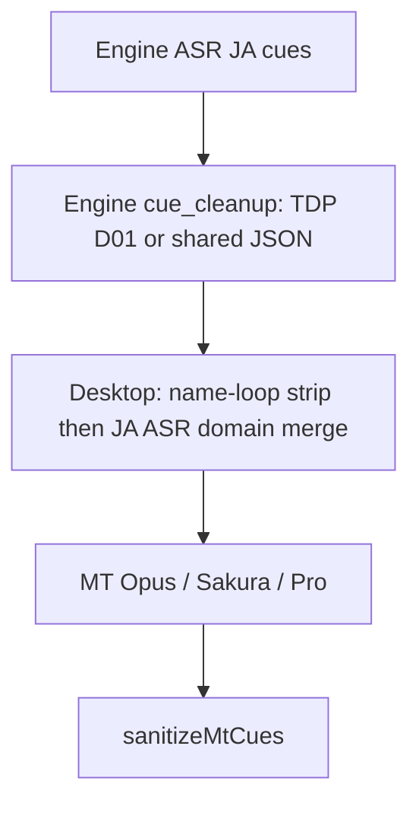

# MT sanitize 分层与意图模型

智能翻译后处理由三层叠加：**JA ASR / D01**、**opaque 语义（ZH）**、**sanitize-core 管线**。它们会在同一 ZH 表面上「互抢」（例如从 ADN-798 **样本**发现的幻觉剥离「肉棒」vs 从 MIDA-762 **样本**发现的临床 remap 保留「肉棒」）。全量 `tests/mt-sanitize.test.js` 仍是最终守门；本页说明如何用**声明式意图**做语义建模，而不是只靠 FIX key 名启发式。

## 硬原则：可复用，不为单片特化

**所有训练与优化必须跨片名可复用。** 番号 / 文件名只是发现问题的样本与 fixture 标签，不是规则作用域。

| 做 | 不做 |
|----|------|
| 按 JA 锚点、临床 ZH 形态、幻觉形状写条件 | `if (title === 'ADN-798')` 或等价片门控 |
| 最短可复用片段 + 日文锚点（训练台已拒整句润色） | 整句润色、只对某一集成立的替换 |
| fixture / `smokeTitles` / remap.`title` 标注**发现来源** | 把片名写进运行时分支 |
| 新规则能解释「下一片同类 cue 也该如此」 | 只为过当前片 grep 而删旧 guard |

训练台文案与 `auto-quality` 的「可复用片段 / 整句复用性差」与此一致；agent 训练同样遵守 `.cursor/rules/mt-sanitize-anti-regression.mdc`。

## 管线顺序



**Post-MT（`sanitizeMtCueText`）大致顺序：** wet-SFX → polish → strip artifacts → NSFW lexicon → `correctZhDomainMistranslations`（先 opaque `applyAdultSemanticFixes`，再 trained remaps / core 规则）→ fluency → blank recover → pin → tidy。

| 层 | 职责 | 落点 |
|----|------|------|
| D01 / JA ASR | 仅 JA `from→to`；成人对在 opaque，encode 时并入 D01 | `shared/ja-asr-domain-fixes.json`、`getAsrAdultDomainPairs`、TDP D01 |
| Opaque ZH | JA 条件的 strip / remap / blank recover | `src/js/mt-opaque-strings.js` |
| Sanitize-core | 编排 + 非敏感 domain / fluency | `src/js/mt-sanitize-core.js` |
| Intent index | 声明对立意图与配对（**不改运行时**） | `src/js/mt-sanitize-intent-core.js` |

## 语义意图（为何需要）

Fixture 可扩展，但难以回答：「这条规则是 strip 还是 remap？和谁对立？fixture 是否还在？是否只是单片特化？」

`mt-sanitize-intent-core` 用声明式记录：

- `kind`: `strip` | `remap` | `recover` | `asr`
- `zhRef`: 指向 `T.*` / `FIX.*`（成人字面量仍不进 intent 文件）
- `pairedWith`: 对立意图 id（如 strip.meatRod ↔ remap.clinicalRod）
- `fixtureRefs`: mocha `it('…')` 标题，冲突报告会校验仍存在
- `smokeTitles`: 发现样本番号（**仅溯源 / 冒烟，不参与匹配**）
- `jaRequireHint` / `jaForbidHint`: 可复用的条件摘要（给人看，不是运行时）

训练时：**先确认模式可复用 → 写意图与配对 → 再写 imperative 与 fixture**；不要删旧 strip 去迁就某一 title 的 grep。

## 冲突报告

```bash
npm run report:mt-conflicts
# → tmp/mt-sanitize-conflict-report.json
```

报告合并：

1. **Intent 分析**：未声明的同 ZH strip↔remap（high）；声明的对立对（info）；ASR `to` 覆盖 strip/remap 表面；缺失 `fixtureRefs`（high）；缺少可复用条件摘要的 canonical 意图（warning）
2. **FIX key 启发式**：strip* vs *OkZh 同 ZH（兜底）
3. **极性探针**（`analyzePolarityProbes`）：现场跑 sanitize，覆盖女高潮 去了↔男 射了、パンパン 不发明肉棒、ちくび≠鸡鸡等

共用词表见 `src/js/mt-sanitize-lexicon.js`（Latin SFX、kana scrap、rod JA、成人扫描锚点、**锚点充分性**、**高潮极性**、**residualScore**、stub 特征倒排）。最新引擎批次扫描：`npm run scan:mt-latest`（DP 对齐 + align_gap / asr_garbage 跳过 + recover 充分性覆盖率 + top residual scores）。

算法要点：

| 能力 | 行为 |
|------|------|
| `isZhSufficientForJa` | 短而正确的高潮/锚点覆盖不算 under |
| `classifyClimaxPolarity` | `prefer_go` / `prefer_shoot` / `abstain`，驱动 soft→射 与 soft_go 桶 |
| `alignCues(..., { mode:'dp' })` | 允许 JA/ZH 空对齐；`alignGap` 不进 under 训练 |
| `matchStubRules` | JA 特征位图 + needs 倒排，再跑 predicate |
| `residualScore` / `rankResiduals` | `reuse × (1-conflictRisk) × freq` 排序训练队列 |

`tools/mt-train` 的 ship-gate 会跑该报告再跑全量 mocha。

## 纪律

见 `.cursor/rules/mt-sanitize-anti-regression.mdc` 与 `tdp-after-training.mdc`。改 opaque / ASR 后必须全量 fixture；涉及 D01 时再跑 `tests/tdp-pack.test.js` 并 `npm run encode:tdp`。
